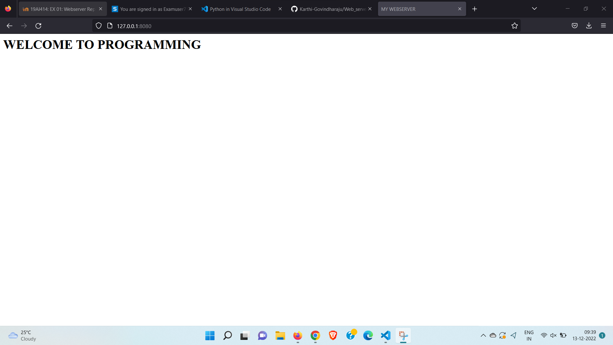
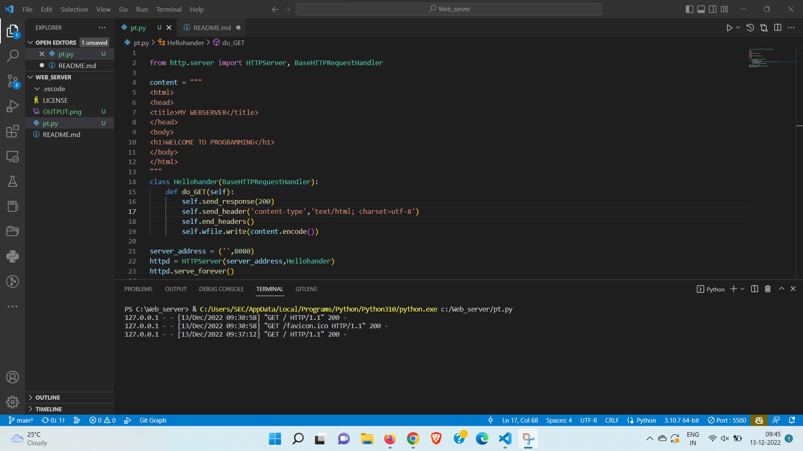

# Developing a Simple Webserver

# AIM:

Develop a webserver to display about top five web application development frameworks.

# DESIGN STEPS:

## Step 1:

HTML content creation is done

## Step 2:

Design of webserver workflow

## Step 3:

Implementation using Python code

## Step 4:

Serving the HTML pages.

## Step 5:

Testing the webserver

# PROGRAM:
``` python
from http.server import HTTPServer, BaseHTTPRequestHandler

content = """
<html>
<head>
<title>MY WEBSERVER</title>
</head>
<body>
<h1>WELCOME TO PROGRAMMING</h1>
</body>
</html>
"""
class Hellohander(BaseHTTPRequestHandler):
    def do_GET(self):
        self.send_response(200)
        self.send_header('content-type','text/html; charset=utf-8')
        self.end_headers()
        self.wfile.write(content.encode())

server_address = ('',8080)
httpd = HTTPServer(server_address,Hellohander)
httpd.server_forever()
```


# OUTPUT:


# RESULT:

The program is executed succesfully
